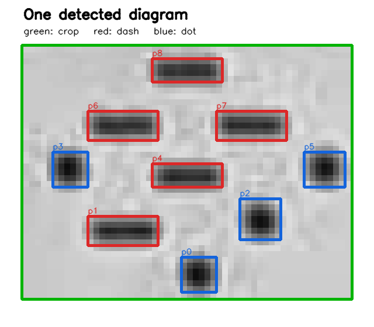
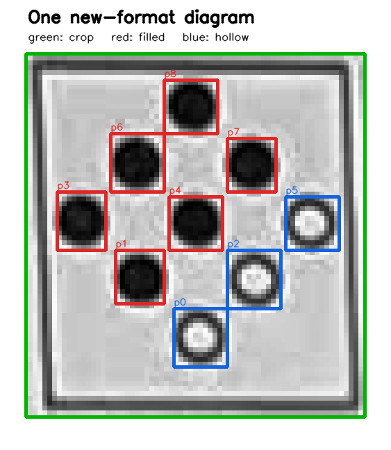

# Pinsheet Scanner

Scan German nine-pin score sheets with a small ONNX detector and deterministic
symbol classification.

## Usage

```bash
uv sync
just scan data/sheets/old/007.jpeg
just scan data/sheets/old/*.jpeg
just boxes data/sheets/new/001.jpeg boxes.png
```

The scan command exits with status `2` when any pin is uncertain. Uncertain pins
are printed as `?` and are not included in a final total.

## Library

```python
from pin import Scanner

scanner = Scanner()  # loads the ONNX model lazily
result = scanner.scan_sheet("data/sheets/old/007.jpeg")

print(result.total_pins)
print(result.needs_review)
```

Reuse one `Scanner` when processing multiple sheets. This loads the detector
only once.

## How it works

1. Rectify the photographed sheet and normalize its contrast.
2. Detect boxed diagrams directly from their contours.
3. Use the ONNX YOLO detector for older unboxed sheets.
4. Classify filled/hollow circles or dots/dashes with connected components.
5. Reject symbols near a classification threshold instead of guessing.
6. Convert cumulative `Abräumen` diagrams into individual throw scores.

The YOLO model uses a fixed `1280 × 1280` input and runs through OpenCV DNN.
PyTorch and Ultralytics are not runtime dependencies.

## Structure

```text
src/pin/                   reusable library
scripts/scan.py            print sheet results
scripts/show_detections.py draw detected boxes
tests/test_scanner.py      sample-sheet regression tests
models/pin_diagram.onnx    detector weights
data/sheets/old/           dot/dash sample sheets
data/sheets/new/           filled/hollow sample sheets
```

## Symbol regions

Old dot/dash format:



New filled/hollow format:



## Development

```bash
just check
just test
```
